- [User Experience](#user-experience)
  - [Description](#Description)
  - [Target Audience](#target-audience)
  - [User Stories](#user-stories)
  - [Client Goals](#client-goals)
- [Design](#design)
  - [Colour Scheme](#colour-scheme)
  - [Fonts](#fonts)
  - [Structure](#structure)
  - [Imagery](#imagery)
  - [Wireframes](#wireframes)
- [Future Implementations](#future-implementations)
- [Technologies Used](#technologies-used)
  - [Frameworks & Tools](#frameworks--tools)
- [Deployment](#deployment)
- [Testing](#testing)
  - [Responsiveness](#responsiveness)
  - [Feature Testing](#feature-testing)
  - [User Story Testing](#user-story-testing)
  - [Browser Compatibility](#browser-compatibility)
  - [Bugs](#bugs)
  - [Performance](#performance)
  - [Code Validation](#code-validation)
  - [Accessibility](#accessibility)
- [Credits](#credits)

## User Experience

### Description

Emilys 2dos is a page that allows users to create and manage a list of tasks and projects. The main goal of this project is to provide users with an easy way to keep track of their tasks and projects, with the added functionalies of marking as done and deleting tasks when completed. And peice of mind the items will remain after the browser is refreshed.

### Target Audience 

Emilys 2Do's is designed to cater to individuals facing the challenges of managing a demanding work or social life, where multiple tasks and projects need to be organized and tracked efficiently. The target audience includes, but is not limited to:

Professionals: Busy professionals who juggle various responsibilities, deadlines, and projects in their work environment. This to-do list can serve as a valuable tool to keep track of their daily tasks, assignments, and meetings.

Students: Students facing a hectic academic schedule with assignments, exams, and extracurricular activities can benefit from using this to-do list to manage their study routine effectively.

Freelancers and Entrepreneurs: Freelancers and entrepreneurs often manage multiple projects and deadlines. This to-do list can help them stay organized and focused on their priorities.

Parents and Caregivers: Parents and caregivers with busy household schedules, appointments, and childcare responsibilities can use this tool to keep their tasks and commitments in order.

Socially Engaged Individuals: People involved in various social activities, community events, and volunteering tasks can utilise this to-do list to manage their commitments and never miss an important event.

Creatives and Artists: Writers, designers, artists, and other creative professionals can use this to-do list to organize their creative projects and track their progress.

Travelers and Event Planners: Individuals planning trips or organizing events can keep track of their tasks and arrangements with this tool.

General Organization Enthusiasts: Anyone who enjoys staying organized and productive can find value in using this to-do list to manage their daily activities.

Emily's 2Do's aims to provide a user-friendly and accessible solution for individuals with diverse lifestyles and busy schedules. Whether it's managing work-related tasks, academic commitments, personal projects, or social engagements, this to-do list offers an effective way to stay on top of various responsibilities without the worry of tasks disappearing, thanks to the local storage feature.

### User Stories

- As a user, I want to enter task items in a text area so that I can add new tasks to my to-do list.

- As a user, I want the to-do list to dynamically update with the newly added tasks so that I can see my tasks in real-time.

- As a user, I want a watermark-styled logo behind the list for an aesthetically pleasing design.

- As a user, I want to mark tasks as completed by left-clicking on them so that I can keep track of my progress and completed tasks.

- As a user, I want to delete tasks from the list by right-clicking on them so that I can remove completed or unnecessary tasks.

- As a user, I want the to-do list to be saved to local storage so that my tasks persist even after closing the browser.

- As a user, I want the ability to toggle between completed and active tasks for better task management.

- As a user, I want to have a clear and user-friendly interface for easy task management.

- As a User, I want to read others' reviews: Users wish to read reviews from other individuals who have used Emily's 2do's to understand how it has benefitted them and whether it meets their task management needs. They want to make informed decisions about using the app based on real user experiences.

- Building Trust and Credibility: By showcasing positive user reviews and testimonials, Emily's 2do's aims to build trust and credibility among potential new users. Positive reviews can act as social proof, assuring users that the app is reliable, user-friendly, and effective in helping them manage their tasks efficiently.

### Client Goals

- Efficient Task Management: The client's primary goal is to provide users with an efficient and user-friendly tool to manage their tasks effectively, helping them stay organized and focused amidst demanding work or social schedules.

- Seamless Task Addition: The client aims to enable users to effortlessly add new tasks to the to-do list through a text area or input field, ensuring a smooth and intuitive task entry process.

- Real-Time Updates: The client seeks to create a dynamic to-do list that updates in real-time, reflecting the tasks added or completed by the user instantly without requiring page refreshes.

- Intuitive Task Completion: The client desires a feature where users can mark tasks as completed with a simple left-click, allowing them to easily track their progress and distinguish between completed and pending tasks.

- Effortless Task Deletion: The client wants to provide users with the ability to delete tasks from the list conveniently, ideally through a right-click or similarly intuitive method.

- Persistent Data Storage: The client's goal is to implement local storage functionality to ensure that the to-do list's tasks are automatically saved, allowing users to access their tasks even after closing the browser or refreshing the page.

- User-Friendly Interface: The client aims to deliver a clear and user-friendly interface, making it easy for users to interact with the to-do list application and manage their tasks efficiently.

- Visual Appeal: The client seeks to incorporate a watermark-styled logo or visual elements that add to the application's overall aesthetic appeal, enhancing the user experience.

#### First Time Visitor Goals

These first-time visitor goals aim to highlight the key features and benefits that new users can expect when using "2Day 2Morrow 2Do". They are designed to give newcomers a quick understanding of what makes your project valuable and why they should consider using it to organise their tasks and projects effectively.

- Effortless Task Entry: Quickly add your tasks using the provided text area, so you can get organized without any hassle.

- Real-Time Updates: See your to-do list update in real-time as you add or complete tasks, ensuring you always have an up-to-date view of your tasks.

- Simple Task Completion: Easily mark tasks as completed with a simple left-click, allowing you to track your progress and stay on top of your to-dos.

- Seamless Task Deletion: Delete completed or unnecessary tasks with a right-click, making task management a breeze.

- Never Lose Your Tasks: Rest assured knowing that your to-do list is automatically saved to your local storage, so your tasks will be there even if you close the browser or refresh the page.

- Stay Organized Anywhere: Access your to-do list from any device with an internet connection, keeping your tasks at your fingertips whether you're at work, home, or on the go.

- Visually Appealing Interface: Enjoy a visually appealing design with a watermark-styled logo, enhancing your experience while managing your tasks.

- User-Friendly and Intuitive: Navigate the application effortlessly with its user-friendly interface, ensuring a smooth and enjoyable task management experience from the moment you start.

- Discovering User Satisfaction: As a first-time visitor to Emily's 2do's, users want to explore the reviews section to discover the experiences of other users. They aim to assess the overall user satisfaction with the to-do list application and gauge its effectiveness in helping manage tasks and projects efficiently.

- Validating App Reliability: First-time visitors seek reassurance about the reliability and credibility of Emily's 2do's. They expect to find genuine user reviews and testimonials that demonstrate the app's utility, ease of use, and positive impact on task organization. By reading reviews, they can feel more confident in trying out the application themselves.

#### Returning Visitor Goals

These returning visitor goals reinforce the positive experience and benefits that users can continue to enjoy when using the application. They encourage users to stay engaged, explore new features, and make the most of the tool to enhance their productivity.

- Efficient Task Management: Continue to experience the convenience of efficient task management, enabling you to stay organized and focused in your busy work or social life.

- Seamless Task Updates: Enjoy the seamless updates to your to-do list as you add or complete tasks, ensuring your task list is always up-to-date and reflects your progress.

- Streamlined Task Completion: Effortlessly mark tasks as completed with a simple left-click, making it easy to keep track of your accomplishments and outstanding tasks.

- Swift Task Deletion: Continue to remove completed or unnecessary tasks with a right-click, maintaining a clutter-free and organized task list.

- Persistent Task Storage: Rest assured that your to-do list remains intact, thanks to automatic local storage, allowing you to access your tasks whenever you return to the application.

- Accessible Anywhere, Anytime: Access your to-do list on any device with internet access, ensuring you can manage your tasks conveniently, no matter where you are.

- Consistently Pleasant Interface: Enjoy the visually appealing design and watermark-styled logo, providing a consistent and pleasant experience as you manage your tasks.

- Familiar User Experience: Continue to navigate the application effortlessly with its user-friendly interface, making task management an enjoyable and familiar process.

- Discover New Features: Explore any new features or updates that may have been added since your last visit, enhancing your task management experience further.

- Share and Spread the Productivity: Consider sharing "2Day 2Morrow 2Do" with friends, family, or colleagues, so they can also benefit from efficient task organization.

## Design
- The design of the website for "Emily's 2do's" follows a minimalist approach, prioritising user focus and ease of navigation. The multi-page layout comprises a homepage, a review page, and a streamlined to-do list interface. The clean and uncluttered design places emphasis on the main elements, creating a visually soothing experience.

The homepage greets visitors with the page's name and a concise call to action, guiding them seamlessly to explore the app's features. The review page showcases genuine user feedback, reinforcing the app's reliability and building trust among potential users.

The to-do list interface exudes simplicity, with a soothing color scheme and intuitive layout. Three simple instructions enable users to effortlessly manage their tasks. The minimalist style reduces distractions, allowing users to focus solely on their to-do list and tasks at hand.

### Colour Scheme

- The color scheme for "Emily's 2do's" website is designed to create a calm and inviting atmosphere. The main background color is a soothing sky blue, complemented by clean white text for clarity. Subtle shades of soft grey add an elegant touch to the interface. Vibrant teal highlights are used for interactive elements, encouraging user engagement. This carefully curated color palette enhances the user experience, promoting focus and productivity. The combination of colors creates a visually appealing and user-friendly interface, making task management a seamless and enjoyable process. With its thoughtful design, Emily's 2do's provides a professional and efficient platform for organizing tasks and projects effectively.

### Fonts

- Image of fonts here 

- I chose the Montserrat Alternates font for "Emily's 2do's" website because of its modern and approachable style. Unlike formal fonts, Montserrat Alternates strikes a balance between professionalism and a friendly vibe, contributing to a positive user experience. Its clean and legible appearance ensures easy readability across different devices and screen sizes. By using this font, I aim to create a user-friendly interface that feels welcoming and engaging. The modern aesthetics of Montserrat Alternates align with the website's minimalist design, promoting a sense of simplicity and focus, making task management a seamless and enjoyable experience for users.

- I used fontjoy.com to aid in font selection for "Emily's 2do's" as it offers a user-friendly platform with an extensive range of font options. The site's interactive features allowed me to experiment and find the perfect font that aligns with the website's modern and approachable style, enhancing the overall user experience.

### Structure 

- Home Page:

The home page serves as the entry point to Emily's 2Do's. It provides users with a brief introduction to the purpose and features of the to-do list. The main element on this page is a prominent and inviting button that prompts users to access the to-do list functionality and review functionality.

Title: Display the "Emily's 2Do's" title at the top of the home page. This helps users quickly identify the application.

Get Started Button: Feature a clear and eye-catching button with a label such as "Get Started". When users click this button, they will be directed to the main to-do list interface.

- To-Do List Interface:

Upon clicking the "Get Started" button on the home page, users will be taken to the main to-do list interface, where they can begin managing their tasks efficiently.

Task Input Area: In the middle of the interface, include a text area or input field where users can enter their tasks. They can type in the task description and press the "Enter" key to add the task to the list.

Task List: Below the input area, display the to-do list as a dynamic and responsive list. As users add new tasks, the list will update in real-time to show the newly added tasks.

Logo Watermark: Provide a visually appealing watermark-styled logo as a background element behind the task list, adding a touch of design to the interface.

Task Interactions: Enable task interactions for users to manage their tasks effectively. Left-clicking on a task will mark it as completed, visually indicating its status. Right-clicking on a task or swiping in any direction on mobile will delete the task.

Local Storage: Implement local storage functionality, ensuring that the to-do list is automatically saved, allowing users to access their tasks even after closing the browser or refreshing the page.

Responsive Design: Create a responsive layout to ensure a seamless experience across various devices, such as desktops, tablets, and smartphones.

- Navigation and User-Friendly Design:

Ensure a user-friendly and intuitive design for easy navigation and a positive user experience throughout the application.

Back to Home Button: On the to-do list interface, provide a button or link to allow users to return to the home page, providing a straightforward way to access the main application page.

Clear and Intuitive Icons: Use clear and intuitive icons for task interactions (e.g., checkmark for completed tasks) to enhance user understanding.

Visual Cues for Actions: Provide visual cues or animations to indicate task completion or deletion for a more engaging user experience.

Consistent Styling: Maintain consistent styling throughout the application, using colors, typography, and spacing that align with the application's visual identity.

- Review page:

On the home page below the "Get started button is also a "Reviews" button.

This page displays a seemless design where past users reviews will stay on the page for 10 seconds with a time gauge to tell the user when it will dissapear. 

The reviews will automatically update.

A home button is provided identical to the todo list interface to maintain style.

### Imagery

#### Review Profile Images

The only images used in the whole project are profile images of the reviewers to give the app a personal and dependable feel. 

These images are thumbnail size with a round border that compliment the small size of the review plate. 

### Wireframes

### Future Implementations

In future updates, I intend to incorporate a categories feature in "Emily's 2do's" to enhance task organisation. This addition will enable users to group their to-do items based on different project types, work, personal tasks, or any customised categories they prefer. By introducing categories, users can streamline their task management process, improving efficiency and clarity. This future implementation aims to provide a more comprehensive and customisable experience, empowering users to stay organised and focused on their priorities effectively.

## Technologies Used

### Languages

- HTML
- CSS
- Javascript

### Framework and Tools

- Fontjoy 
- Google Fonts 
- Font Awesome
- Pexels 
- GitHub 
- Gitpod 
- W3Schools 

## Deployment 

### Deploying the website with GitHub pages 

- The website was deployed using GitHub Pages by following these steps:

1. In the GitHub repository navigate to the Settings tab.
2. On the left-hand menu select Pages.
3. For the source select Branch: master.
4. After the webpage refreshes automatically, you will see a ribbon on the top saying: "Your site is published at ##################################

- You can fork the repository by following these steps:

1. Go to the GitHub repository.
2. Click on the Fork button in the upper right-hand corner.
3. Cloning the Repository

- You can clone the repository by following these steps:
1. Go to the GitHub repository.
2. Locate the Code button above the list of files and click it.
3. Select if you prefer to clone using HTTPS, SSH, or Github CLI and click the copy button to copy the URL to your clipboard.
4. Open Git Bash.
5. Change the current working directory to the one where you want the cloned directory.
6. Type git clone and paste the URL from the clipboard ($ git clone https://github.com/YOUR-USERNAME/YOUR-REPOSITORY).
7. Press Enter to create your local clone.

## Testing

### Responsiveness 

The Website i fully responsive across all screen sizes. e.g. Desktop, laptop, tablet and mobile devices. Please see below examples of various devices.

### Devices 

iPhone 5

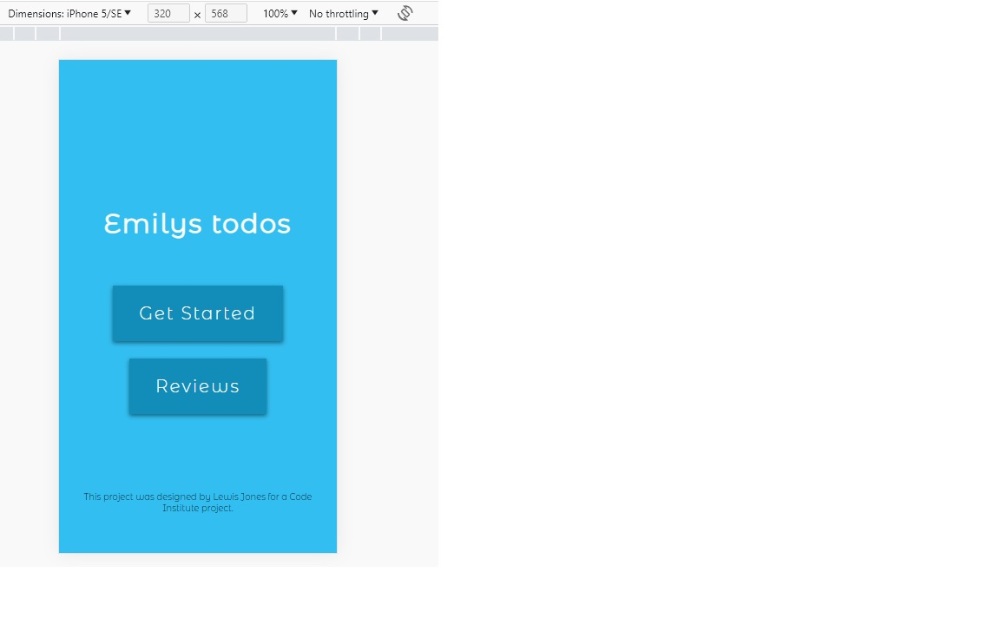
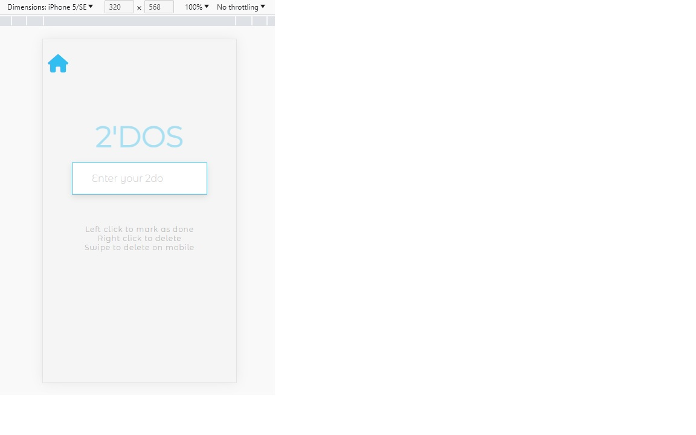
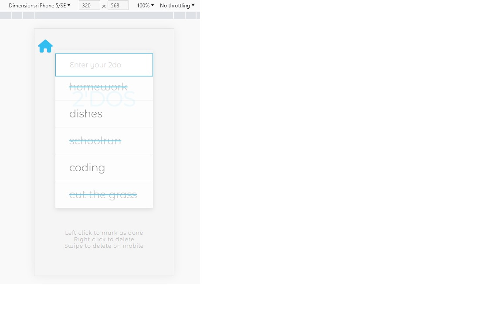
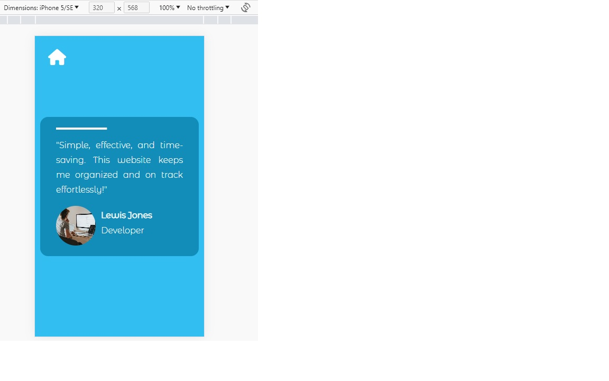

iPad Air

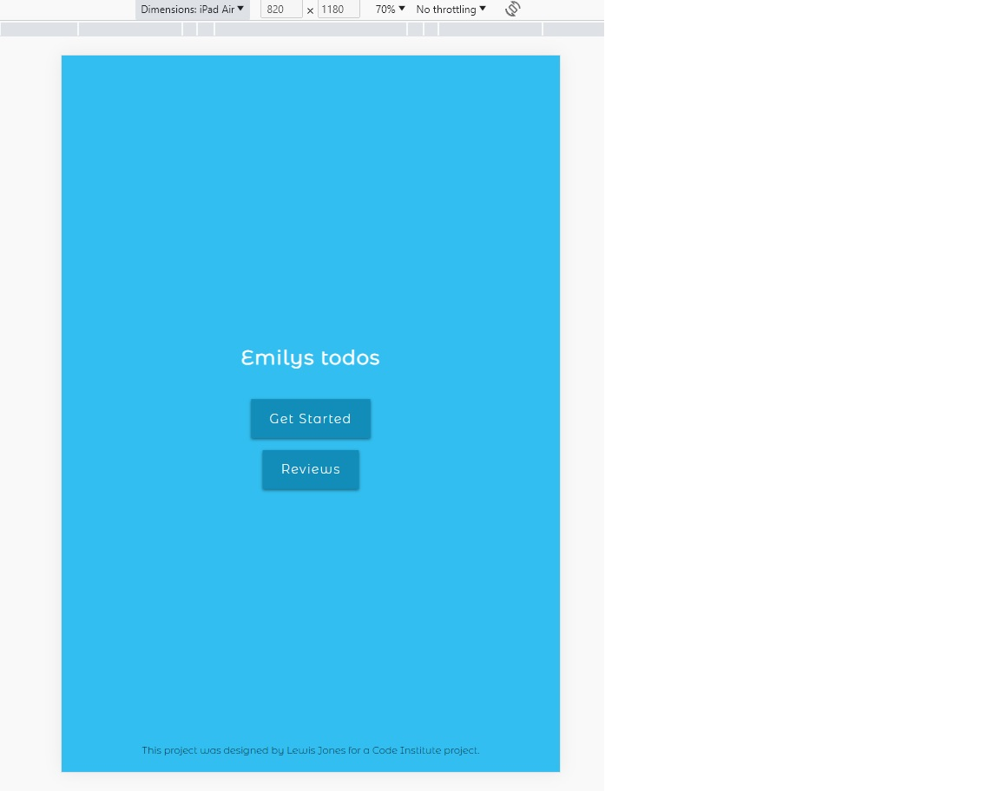
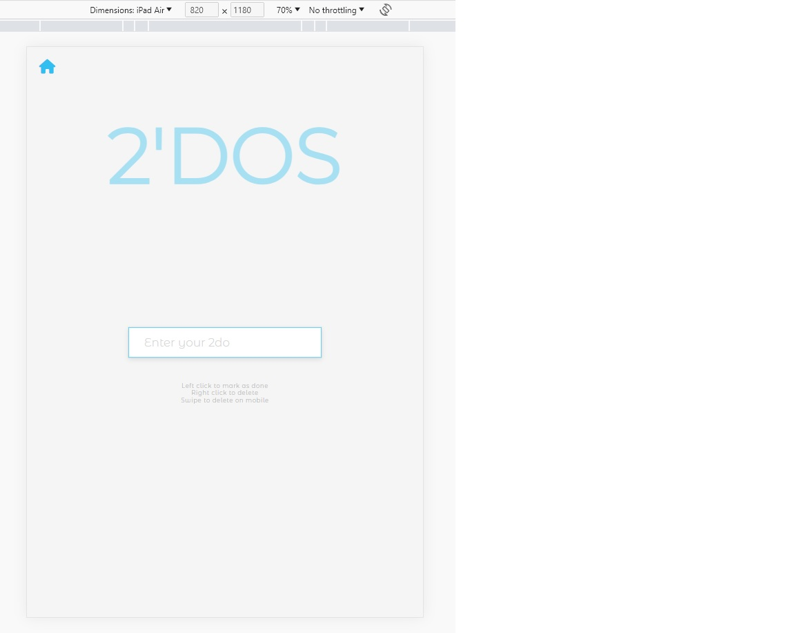
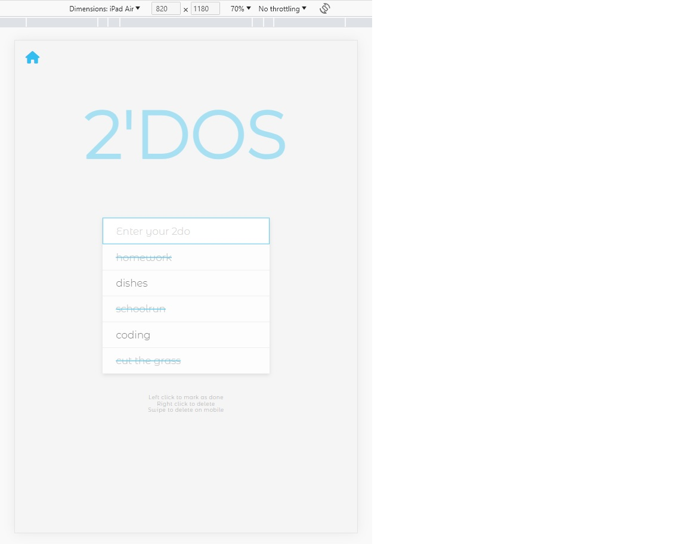
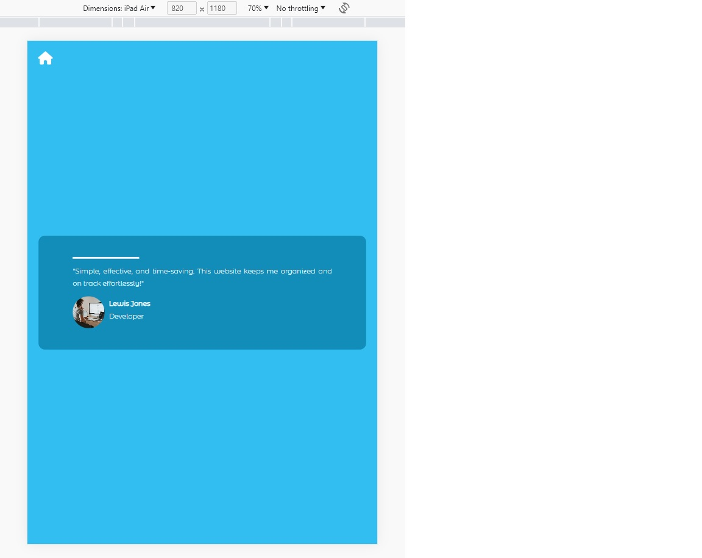

Desktop

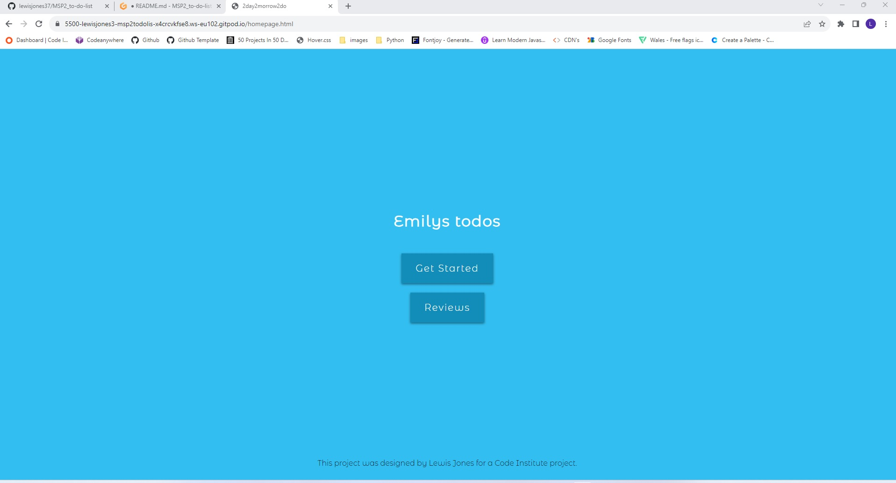
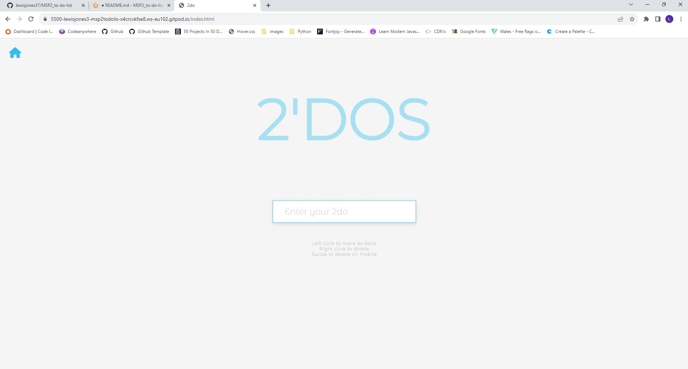
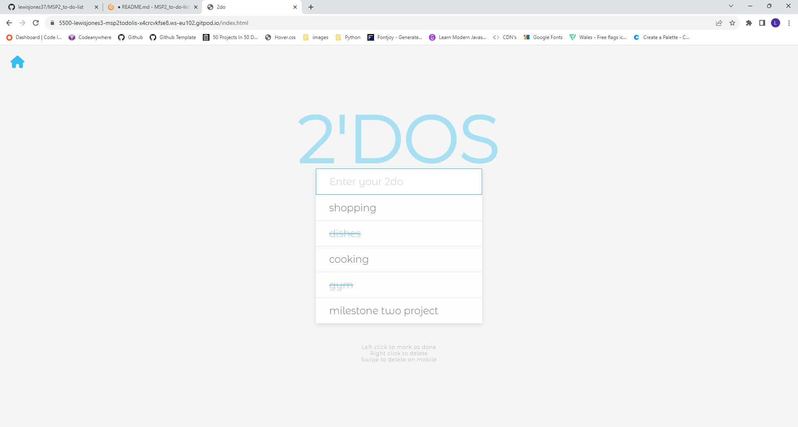
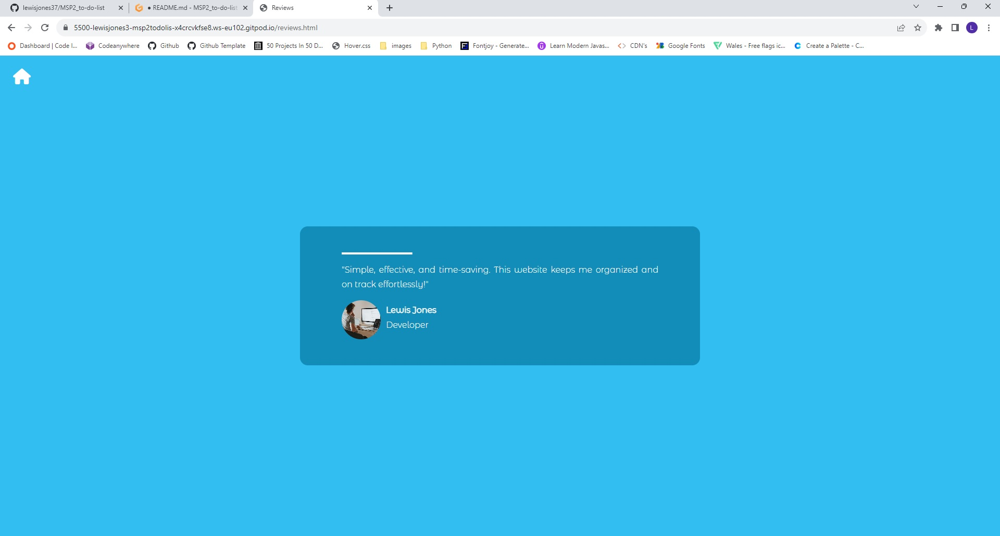

